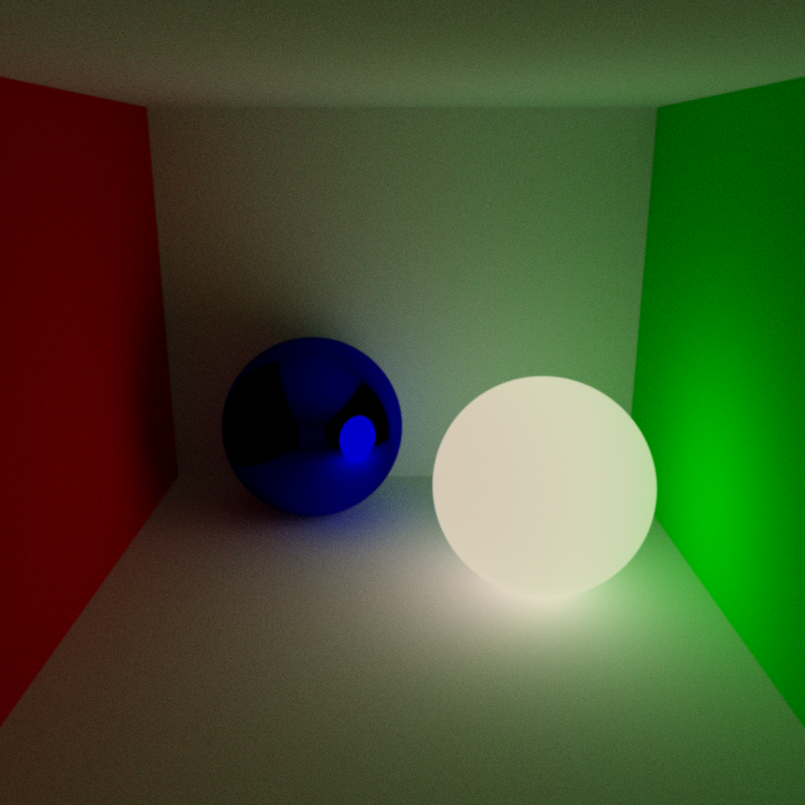
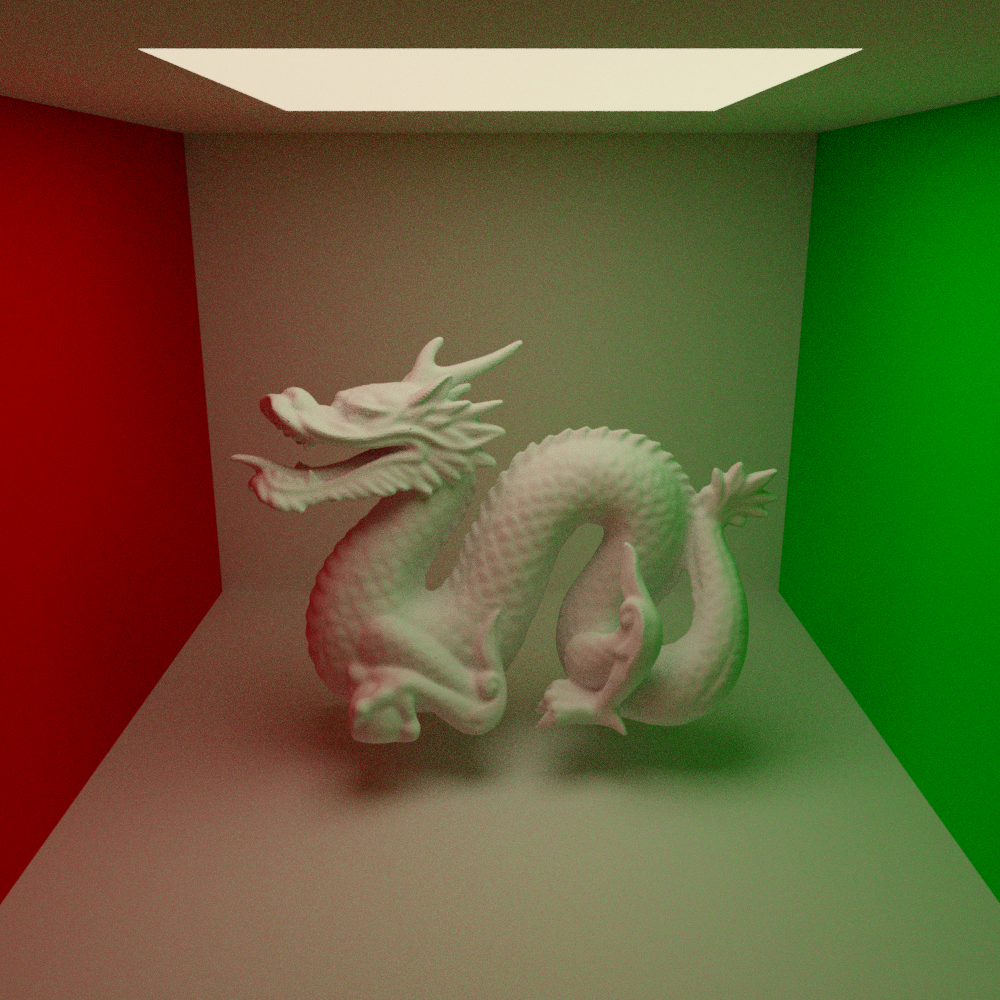
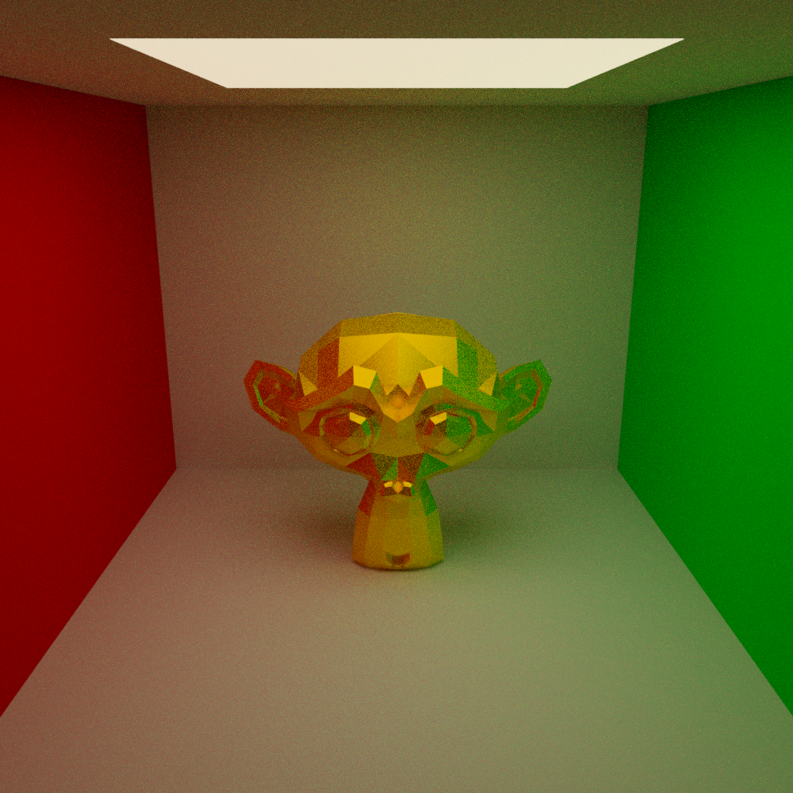

# C++ Pathtracing

This project implements Monte Carlo Pathtracing and is written in C++, with the aim of creating realistic renders.


### Objects

Multiple kinds of primitives such as spheres, planes, rectangles, and triangles are implemented. Additionally, complex objects consisting of multiple triangles/quads can be specified in a .obj file using the Wavefront OBJ format. These objects can consist of a large amount of primitives, enabled by the implementation of a Bounding Volume Hierarchy (BVH) datastructure.

### Materials

This project includes multiple different material models, including but not limited to diffuse materials, reflective materials, transparent materials, and microfacet materials. Some simple media are also implemented, allowing the modelling of homogenous scattering media such as clouds, as well as clear media like coloured glass. UV mapping is also supported, allowing the use of complex textures for albedo, roughness, as well as light emission colour & strength.


### Denoising

In order to reduce the noise level of the resulting image, À-trous wavelet denoising has been implemented, with configurable parameters.

### Example scenes
Below are a few different example scenes, showcasing different objects and materials in a cornell box-like scene.


|  |  |
|:----------------------------------:|:----------------------------------:|
|             Example 1              |             Example 2              |
|  |  |
|             Example 3              |             Example 4              |


## Usage
To run the program and generate an image, simply execute the shell script `main.sh` file:

```
Usage: ./main.sh [OPTIONS] [ARGS]

Options:
  -c, --compile           Compiles the project before running. (optional)
  -n, --name <name>       Specify a name that ends in '.png', default 'result.png' (optional)
  -h, --help              Show this message (optional)

Example:
  ./main.sh --compile --name 'result.png'
```


### Limitations

This project does not explicitly support transparent objects intersecting eachother, and their inclusion can result in inaccurate results.

Furthermore, this project was tested and compiled on MacOS using the clang compiler, and is not guaranteed to work on other platforms or with other compilers.
