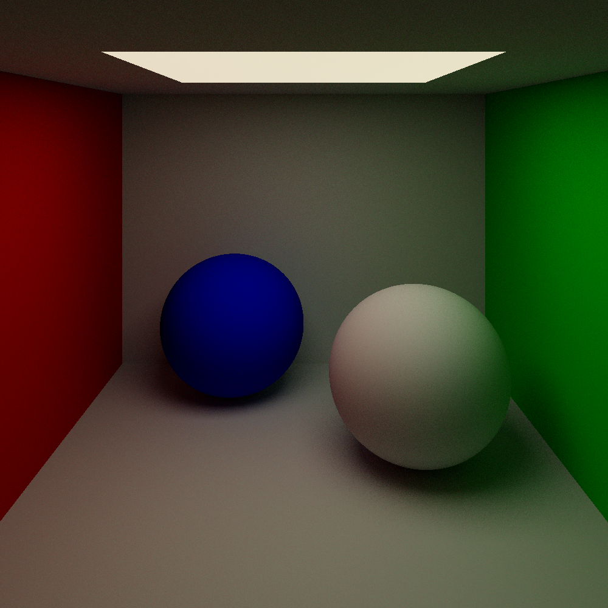
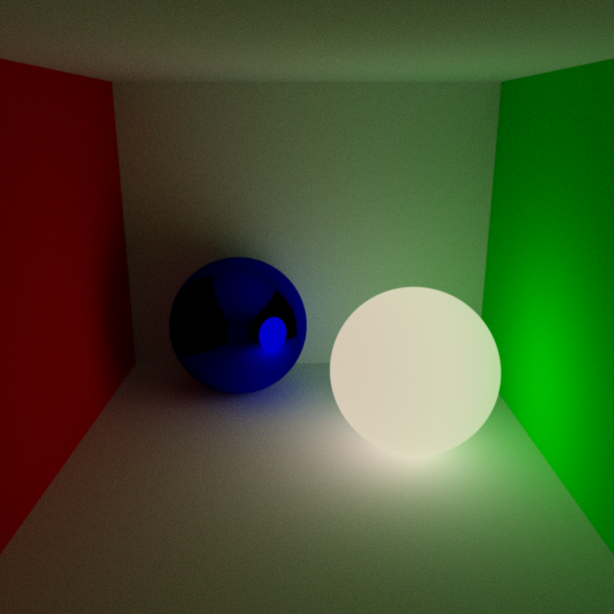
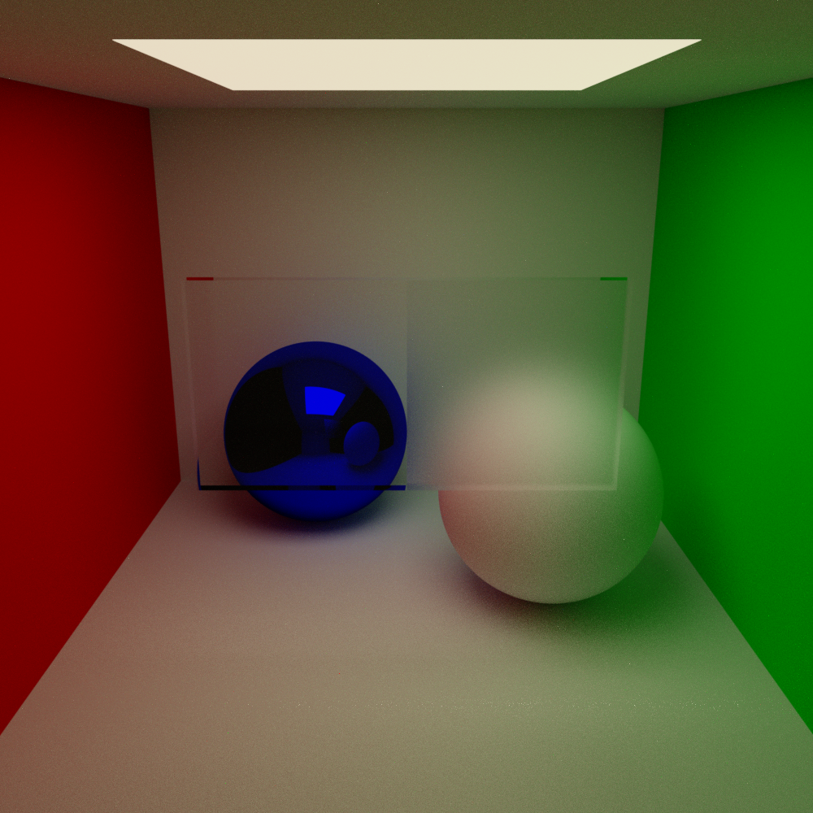
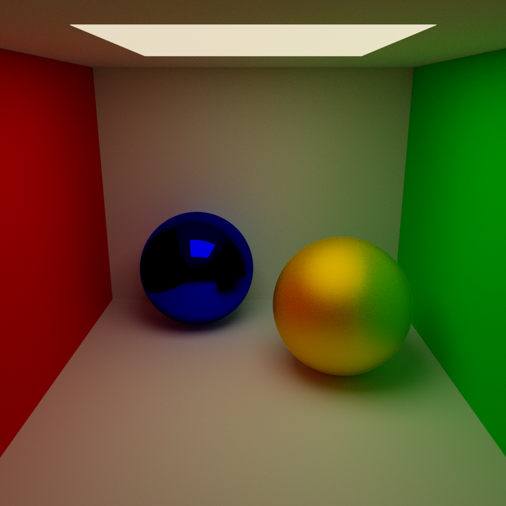

# C++ Pathtracing

This is a path tracer, written in C++, aiming to create realistic renders of a scene by simulating the path light takes. Primitives such as spheres, planes, rectangles and triangles have been implemented. Objects can be specified in a .obj file, and will be converted to a series of triangle primitives. Multiple different material types have also been implemented; diffuse materials, reflective materials, transparent materials, and microfacet materials.


### Example scene
Below are a few different example scenes, showcasing different objects and materials.


|  |  |
|:----------------------------------:|:----------------------------------:|
|             Example 1              |             Example 2              |
|  |  |
|             Example 3              |             Example 4              |


## Usage

To run the ray tracing simulation and generate an image, simply execute the shell script `main.sh` file:

```
./main.sh
```

### Notes

This project does not explicitly support objects intersecting other objects, and can result in inaccurate results in regard to transparent.

Furthermore, this project was tested and compiled on MacOS using the g++ compiler, and is not guaranteed to work on other platforms.